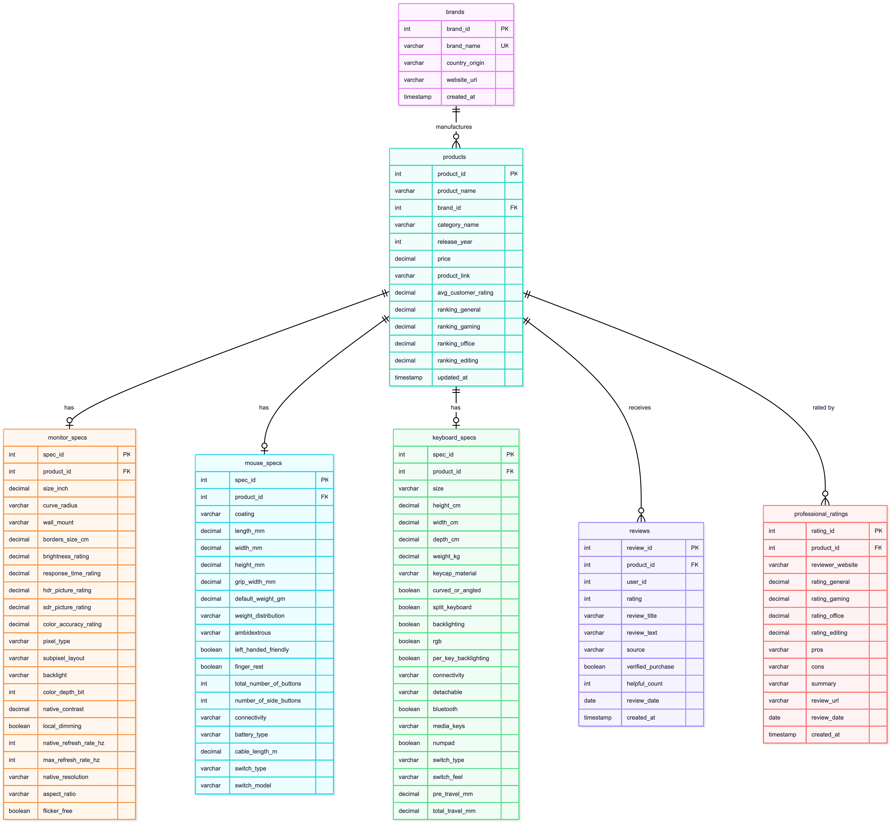
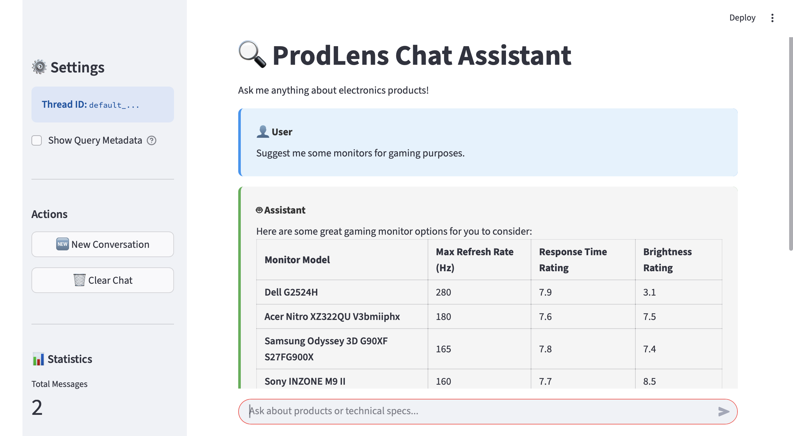

# ProdLens: Intelligent Querying for Electronics Data  
**Team:** Dipan Bag, Monte Mahlum, Prashant Rao, Tejeshwini Ramesh Subasri  

## Overview

ProdLens is an intelligent querying system for consumer electronics data. It unifies **structured SQL retrieval**, **semantic search via RAG**, and **LLM-powered query routing** to answer natural-language questions about electronics such as monitors, keyboards, and mice.

The project integrates:

- A **PostgreSQL relational database** for product specifications, ratings, and reviews  
- A **vector database (Chroma)** for embeddings of unstructured text such as guides and opinions  
- An **AI-driven router** (LangGraph) that decides whether a user query requires SQL, RAG, or a hybrid of both  
- A **Streamlit interface** for interactive querying and analytics

---

## Features

- **Hybrid Query Engine:** Combines Text2SQL, RAG, and intent routing  
- **Structured + Unstructured Retrieval:** Lookup specs, compare products, analyze review sentiment  
- **Data Ingestion Pipelines:** Load, normalize, and embed electronics data  
- **Analytics Dashboard:** Product popularity, sentiment insight, feature analysis  
- **Vector Store Integration:** Embeddings for long-form text and reviews  

---

## Quick Start

### 1. Install Dependencies

```bash
pip install -r requirements.txt
```

### 2. Configure Environment Variables  
Create a `.env` file (or export environment variables):
```ini
OPENAI_API_KEY=
CHROMA_API_KEY=
TENANT_KEY=
DB_HOST=
DB_NAME=
DB_USER=
DB_PASSWORD=
DB_PORT=
LOG_LEVEL=INFO
```  
    
### 3. Launch the Application  
```bash
streamlit run app.py
```  
  
## Project Structure  
```bash
.
├── app.py                     # Streamlit UI (main entrypoint)
├── data/                      # Raw + cleaned CSVs
├── ingestion/                 # Structured + embedding ingestion pipelines
├── embeddings/                # Embedding utilities + vector DB prep
├── support/                   # Helpers (LLM graph, DB connection, logging)
│   ├── graph.py
│   ├── logger.py
│   ├── nodes.py
│   └── rdb_conn.py
├── templates/                 # Prompt templates for routing + SQL generation
├── vectorDB/                  # Chroma collections + local persistence
├── files/                     # Static assets (images, diagrams)
└── test.ipynb                 # Experiments and prototypes
```  
  
## Key Components

### 1. Query Engine (LangGraph)
Located in `support/graph.py` and `support/nodes.py`.

- Interprets natural-language queries  
- Classifies intent (SQL, RAG, or Hybrid)  
- Executes:
  - **Text2SQL** for structured retrieval from PostgreSQL  
  - **RAG** using vector search from Chroma  
  - **Hybrid mode** when both structured and unstructured data are required  
- Uses LLM prompting and routing logic defined in `templates/`  
- The LangGraph workflow graph is as follows:  


---

### 2. Relational Database (PostgreSQL)

Stores structured product information including:

- Product metadata (name, brand, category)  
- Specifications (size, resolution, connectivity, features, etc.)  
- Professional ratings  
- Customer reviews & sentiment scores  

SQL schema file is available in `files/` directory.  
Database connection utilities live in `support/rdb_conn.py`.  



---

### 3. Vector Database (Chroma)

Stores embeddings generated from unstructured text sources:

- Reference guides  
- Customer opinions  
- Long-form reviews  
- Comparative articles  

Supports:

- Semantic search  
- RAG responses  
- Context retrieval for LLM routing  

Texts for ChromaDB collections in JSON format are stored in `files/` directory.

---

### 4. Data Ingestion Pipelines

Located in `ingestion/`.

Pipelines perform:

- CSV → normalized JSONL transformation  
- Cleaning and deduplication of product data  
- Embedding generation for unstructured text  
- Loading data into PostgreSQL and Chroma  

Supports large-scale ingestion and incremental updates.

---

### 5. Streamlit Interface

Defined in `app.py`.

Features:

- Chat-based querying using the ProdLens Query Engine  
- Analytics dashboards for:
  - Product popularity  
  - Sentiment trends  
  - Feature-driven review insights  
- Live examples and visualizations  
- The Streamlit UI:  


---

### 🔹 6. Shared Helpers (`support/`)

Utility modules used across the system:

- `graph.py` — LangGraph routing engine  
- `nodes.py` — Nodes for SQL, RAG, and hybrid execution  
- `logger.py` — Structured logging  
- `rdb_conn.py` — Database connection + pooling  

---

### 🔹 7. Prompt Templates

Located in `templates/`.

Includes:

- Routing prompts  
- Text2SQL prompts  
- Post-processing prompts  
- Error-handling templates  

These ensure consistent and predictable LLM behavior.

---


